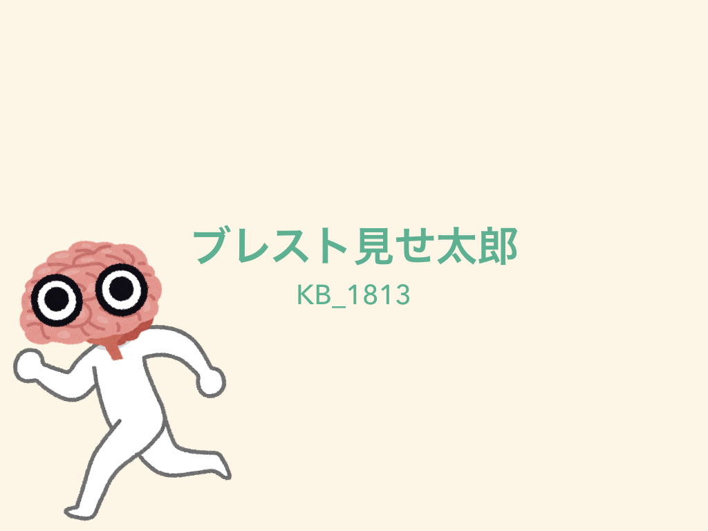

# ブレスト見せ太郎

[**ブレスト見せ太郎の製品ページへ**](https://jphacks.github.io/KB_1813/)

## 製品概要
### ブレインストーミング × Tech

### 背景（製品開発のきっかけ、課題等）

**テーマのアイデア出しのためにブレインストーミングをしていたけど，メモを取るのがめんどくさい！**

ブレインストーミングを使ってアイデア出しを行っていたが，メモの取り忘れが多発した．
メモを取ることのめんどくささを解消するために，ブレインストーミングの自動生成に思い至った．

**これは，会議に関わるありとあらゆる人たちを救うアプリである**

現状は，ブレインストーミングは手書きで行われている．
議論が白熱していると，メモを取り忘れてしまうことが課題となっている．

### 製品説明（具体的な製品の説明）

このアプリはブレインストーミングを半自動的に生成する．
<!-- 基本的には自動的に話題となっている単語どうしがリンクされていく． -->
基本的には話題となる単語を選択することで，その話題を中心に自動でブレインストーミングから抽出された単語がリンクされていく．
<!-- ただし，中心となる話題が切り替わった時，間違ったリンクが貼られてしまった時のみ，ユーザの操作が必要なため，半自動的なアプリになっている．-->
ただし，中心となる話題が切り替わった時や，間違ったリンクが貼られてしまった時に，ユーザの操作により手動でリンク付けの修正を可能にしている．

### 特長

#### 1. 特長1
<!-- 文章からキーワード -->
話題のキーワードを抽出する

#### 2. 特長2
<!-- キーワードからリンク情報 -->
キーワード同士のリンク付けを半自動で行う

#### 3. 特長3
<!-- リンク情報により話題を可視化 -->
どの話題を中心にして話しているか可視化する

#### 使い方補足
- 入力中に's'を押すと，強制的に入力を打ち切る

### 解決出来ること
ユーザはメモを取る必要がなくなり，会話を中心にしてブレインストーミングを行える．

### 今後の展望
- 会議の内容を引き継げるようにデータベースを作成する
- ユーザが個々人のデータを閲覧できるように認証設定を行う

## 開発内容・開発技術
### 活用した技術
#### API・データ
今回スポンサーから提供されたAPI、製品などの外部技術があれば記述をして下さい。

* [gooラボ 形態素解析](https://labs.goo.ne.jp/api/jp/morphological-analysis/)

#### フレームワーク・ライブラリ・モジュール
* [jQuery](https://jquery.com/)
* [vis.js](http://visjs.org/)

### 独自開発技術（Hack Dayで開発したもの）
#### 2日間に開発した独自の機能・技術
* 
